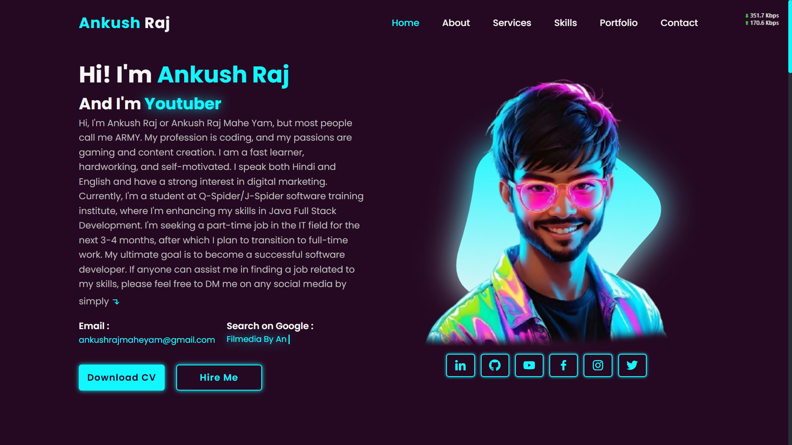

# **Portfolio Website**

Welcome to my **Portfolio Website** repository! This project showcases my(**Ankush Raj**) work, skills, and achievements as a **Software Developer** and **Tech Enthusiast**. Feel free to explore and check out my projects, including full-stack development work, web development, and more.

## 🚀 **About This Project**
This website serves as an online portfolio to display my skills, projects, and accomplishments. It is built using **HTML**, **CSS**, and **JavaScript**. The website is fully responsive and offers a user-friendly interface to present my work to potential clients, employers, and collaborators.

## 🛠️ **Tech Stack Used**
- **HTML5**: For structuring the content.
- **CSS3**: For styling and responsive design.
- **JavaScript**: For interactivity and dynamic features.

## 🌐 **Live Demo**
You can view the live version of my portfolio here:  
[My Portfolio Website](https://ankushrajmaheyam.github.io/Portfolio-Website/)


## 💻 **Installation**

To run this project locally, follow the steps below:

1. Clone this repository to your local machine:
   ```bash
   git clone https://github.com/AnkushRajMaheYam/Portfolio-Website
   ```

2. Open the `index.html` file in your browser.

## 📄 **Features**
- **Responsive Design**: The website is mobile-friendly and looks great on all devices.
- **Showcase of Skills**: Displays my expertise in various technologies and tools.
- **Project Showcase**: Highlights the most significant projects I have worked on.

## 🌟 **Connect with Me!**
Feel free to explore more of my work and get in touch:  
🔍 **Search on Google:** [Ankush Raj Mahe Yam](https://www.google.com/search?q=ankush+raj+mahe+yam)  
🌟 **Portfolio:** [Ankush Raj](https://ankushrajamaheyam.blogspot.com)  
💼 **LinkedIn:** [Ankush Raj](https://linkedin.com/in/AnkushRajMaheYam)  
💻 **GitHub:** [Ankush Raj](https://github.com/AnkushRajMaheYam)  
🎯 **LeetCode:** [Ankush Raj](https://leetcode.com/u/AnkushRajMaheYam)  
🏅 **HackerRank:** [Ankush Raj](https://www.hackerrank.com/profile/ankushrajmaheyam)  
📸 **Instagram:** [Ankush Raj](https://instagram.com/AnkushRajaMaheYam)  
📘 **Facebook:** [Ankush Raj](https://facebook.com/AnkushRajMaheYam)  
🎨 **Fiverr:** [Ankush Raj](https://www.fiverr.com/ankushrajmaheya)  
🛠️ **Upwork:** [Ankush Raj](https://www.upwork.com/freelancers/~01bf6d1e8483199ba6)  

## 🔥 **Hashtags & Keywords**
#AnkushRajMaheYam #PortfolioWebsite #WebDevelopment #FullStackDevelopment #JavaScript #HTML #CSS #TechPortfolio #SoftwareDeveloper #TechEnthusiast #OpenSource


## License

This project is licensed under the MIT License - see the [LICENSE.md](LICENSE.md) file for details.
